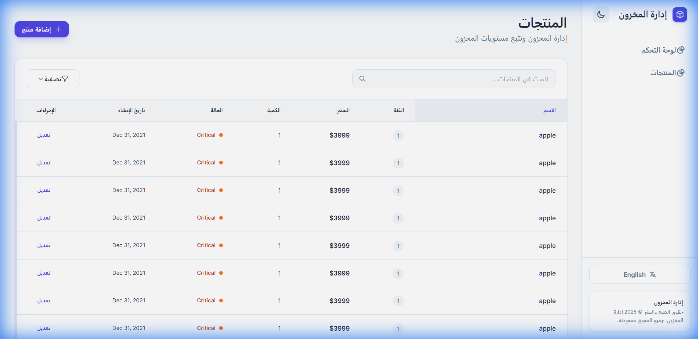
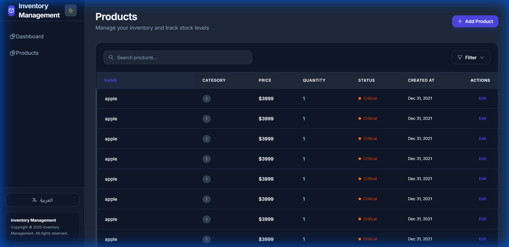

# Inventory Management System

| Light Mode | Dark Mode |
|------------|-----------|
|  |  |

A modern, responsive Inventory Management System built with Angular 21, featuring:
- **Dark Mode Support**: Seamlessly toggle between light and dark themes.
- **Multi-language Support**: Full Arabic and English support with RTL/LTR layout adjustment.
- **Product Management**: Add, edit, and track inventory items with real-time status indicators.
- **Responsive Design**: Optimized for both desktop and mobile devices.
- **Modern UI**: Built with Tailwind CSS for a premium look and feel.

This project was generated using [Angular CLI](https://github.com/angular/angular-cli) version 21.0.0.

## Development server

To start a local development server, run:

```bash
ng serve
```

Once the server is running, open your browser and navigate to `http://localhost:4200/`. The application will automatically reload whenever you modify any of the source files.

## Code scaffolding

Angular CLI includes powerful code scaffolding tools. To generate a new component, run:

```bash
ng generate component component-name
```

For a complete list of available schematics (such as `components`, `directives`, or `pipes`), run:

```bash
ng generate --help
```

## Building

To build the project run:

```bash
ng build
```

This will compile your project and store the build artifacts in the `dist/` directory. By default, the production build optimizes your application for performance and speed.

## Running unit tests

To execute unit tests with the [Karma](https://karma-runner.github.io) test runner, use the following command:

```bash
ng test
```

## Running end-to-end tests

For end-to-end (e2e) testing, run:

```bash
ng e2e
```

Angular CLI does not come with an end-to-end testing framework by default. You can choose one that suits your needs.

## Additional Resources

For more information on using the Angular CLI, including detailed command references, visit the [Angular CLI Overview and Command Reference](https://angular.dev/tools/cli) page.
